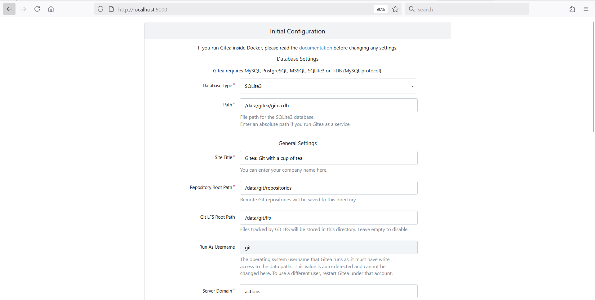
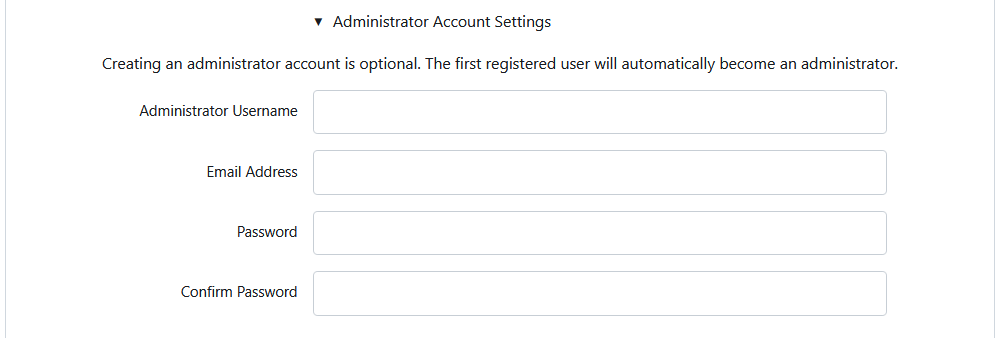

# IoT Gateway — Setup and Startup Guide

This guide walks through setting up and starting the full IoT Gateway stack:

| Component | Role |
|-----------|------|
| **Gateway** | Receives sensor data over MQTT, processes it, and forwards it to the monitoring stack |
| **Monitoring** | Visualizes metrics and logs; provides the control plane (Grafana, Streamlit, Gitea, Prometheus) |
| **Fake Sensor** | Generates simulated sensor traffic for testing (optional) |

All commands below assume you are at the repository root unless a `cd` step is shown.

---

## Prerequisites

- Docker and Docker Compose installed
- `openssl` available (used by `cert-generation.sh`)
- Network access to the gateway host

### 1. Update IP addresses

Find the gateway machine IP:

```shell
ip addr
# or
ifconfig
```

Use the `inet` address of your primary interface (for example `10.185.71.215` on `eth1`).

Update the following files with that IP:

**`cert-generation.sh`** — server certificate common name:

```shell
SERVER_CN="<your-gateway-ip>"
```

**`fake_sensor/build/sensor*/test_sensor_data.sh`** — MQTT broker host (sensors 1–4 used by cert generation):

```shell
HOST="<your-gateway-ip>"
```

> Sensors 5–9 also have `test_sensor_data.sh` scripts; update `HOST` there as well if you plan to run them.

### 2. Set permissions

From the repository root, grant broad write access so containers can read and write mounted volumes:

```shell
sudo chmod -R 777 .
```

### 3. Update Gitea workflow volume paths

Gitea Actions workflows mount host directories into runner containers. Update the `volumes` section in every YAML file under:

```
monitoring/scripts/gitea_actions/.gitea/workflows/
```

Replace placeholder paths with your actual checkout location. Gateway files live under the `gateway/` subdirectory:

```yaml
volumes:
  - /path/to/iot-gateway/gateway/mosquitto/config/acl:/mosquitto/config/acl
  - /path/to/iot-gateway/gateway/mosquitto/config/passwords:/mosquitto/config/passwords
  - /path/to/iot-gateway/gateway/docker-compose.yaml:/iot-gateway/docker-compose.yaml
  - /path/to/iot-gateway/gateway/haproxy/allowed-ips.txt:/haproxy/allowed-ips.txt
```

Workflows that touch certificates or sensor builds also need paths such as:

```yaml
  - /path/to/iot-gateway/gateway/certs:/server/certs
  - /path/to/iot-gateway/fake_sensor/build/sensor1:/client/sensor1/certs
```

Check each workflow file — volume mounts differ per job.

---

## Startup procedure

Services must be started in order: **certificates → gateway → monitoring → fake sensors (optional)**.

### Step 1 — Generate certificates

From the repository root:

```shell
bash cert-generation.sh
```

This script:

- Creates CA, server, and client certificates for sensors 1–4
- Copies certs into `gateway/certs/` and `fake_sensor/build/sensor{1..4}/`
- Rebuilds fake-sensor images and restarts Mosquitto and HAProxy if the gateway is already running

### Step 2 — Start the gateway

```shell
cd gateway
docker compose build
docker compose up -d
```

Gateway services include Mosquitto, HAProxy, Node-RED, Promtail, IDS, and related exporters.

### Step 3 — Start the monitoring stack

```shell
cd monitoring
docker compose build
docker compose up -d
```

Wait until containers are healthy, then open [http://localhost:5000](http://localhost:5000).

#### First-time Gitea setup

On a fresh install, Gitea shows the installation wizard:



Open **Administrator Account Settings**:



Create the admin account:

| Field | Value |
|-------|-------|
| Administrator Username | `admin` |
| Email Address | `admin@localhost` |
| Password | `admin` |
| Confirm Password | `admin` |

Click **Install Gitea**.

After installation, bring the stack back up so seeding can finish:

```shell
docker compose up -d
```

Wait until the `gitea-seed` container completes. It creates the `admin/actions` repository, pushes workflow definitions, and registers the Gitea runner.

### Monitoring dashboards

| Service | URL | Credentials |
|---------|-----|-------------|
| Grafana | [http://localhost:3210](http://localhost:3210) | `admin` / `admin` |
| Streamlit (control plane) | [http://localhost:8000](http://localhost:8000) | — |
| Gitea | [http://localhost:5000](http://localhost:5000) | `admin` / `admin` |
| Prometheus | [http://localhost:9090](http://localhost:9090) | — |

---

### Step 4 — Start fake sensors (optional)

```shell
cd fake_sensor
docker compose build
docker compose up -d
```

> Run fake sensors only for short test windows. Continuous simulated traffic can fill log and metrics storage quickly.

#### Allow sensor IPs in HAProxy

Fake sensors connect from Docker bridge networks. HAProxy only forwards traffic from IPs listed in `gateway/haproxy/allowed-ips.txt`.

1. Get a sensor container IP:

   ```shell
   docker exec -it fake_sensor-sensor1-1 hostname -I
   ```

   Example output: `172.20.0.10`

2. Add the IP (or the whole Docker subnet) to `gateway/haproxy/allowed-ips.txt`:

   ```
   172.20.0.10
   ```

   To allow all containers on the bridge network at once:

   ```
   172.20.0.0/16
   ```

3. Restart HAProxy from the repository root:

   ```shell
   docker compose -f gateway/docker-compose.yaml restart haproxy
   ```

You can also manage allowed IPs through the Streamlit control plane or the **Update Device IP** Gitea workflow once the runner is registered.